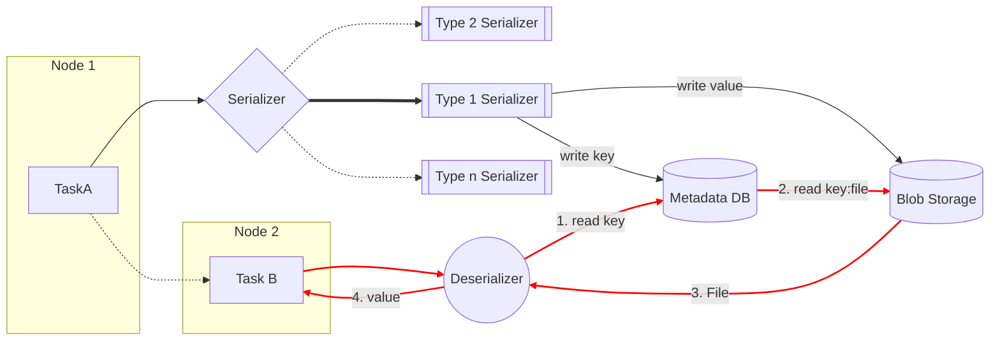
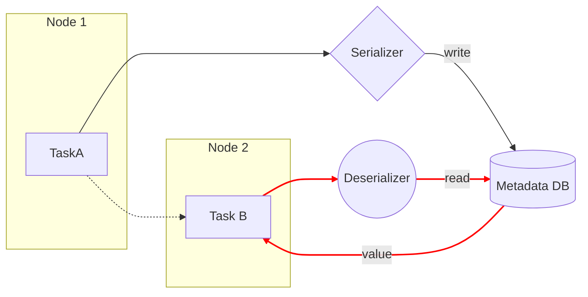

<style>
img[src*='#left'] {
    float: left;
}
img[src*='#right'] {
    float: right;
}
img[src*='#center'] {
    display: block;
    margin: auto;
}
img[alt=drawing] { width: 500px; }

</style>


<style>
.center {
    text-align: center;
}
</style>

<html>
<head>
<style>
figcaption {
  color: white;
  font-style: italic;
  padding: 2px;
  text-align: center;
}
</style>

# `Airflow`

<br></br>


## Introdução: Termos técnicos


----------- 

[**Task**] Uma tarefa representa uma unidade de trabalho individual em um fluxo de trabalho do Airflow. Pode ser uma ação específica que precisa ser executada, como executar uma consulta em um banco de dados, mover arquivos, executar um script Python, enviar notificações, entre outras ações. As tarefas são definidas como **Operadores** e **Sensores** no Airflow, que encapsulam a lógica e a execução dessas ações.

Cada tarefa é independente e pode ter dependências de outras tarefas.  Essas dependências são definidas explicitamente na criação dos `DAGs`.


[**DAG**]
Um DAG é um conjunto de `tasks` acíclicas que definem o fluxo de trabalho geral no Apache Airflow. Ele é composto por tarefas interconectadas e suas dependências. As tarefas são organizadas em um DAG para representar a sequência de execução e as relações de dependência entre elas.

[**Hooks**]  são interfaces de nível baixo que permitem a comunicação entre o Airflow e várias fontes externas, como bancos de dados, sistemas de arquivos, serviços da web, entre outros. Eles fornecem métodos para se conectar, extrair e carregar dados dessas fontes externas. Os Hooks encapsulam a lógica necessária para interagir com sistemas específicos e oferecem uma abstração consistente para o acesso aos dados. Dessa forma, eles facilitam a reutilização de código e tornam mais simples a criação de tarefas que interagem com diferentes sistemas externos. Tanto os **Sensores** quanto os **Operadores**, podem, e muitas vezes utilizam um **Hook**.

[**Sensores**]
são uma categoria especial de `task` no Airflow que aguardam a ocorrência de um determinado evento ou condição antes de prosseguir para a próxima etapa do fluxo de trabalho. Eles são usados para esperar por mudanças de estado, como a criação de um arquivo em um diretório, a disponibilidade de um serviço, a conclusão de uma tarefa em outro fluxo de trabalho, entre outros. Os sensores são úteis para aguardar o estado ou a condição desejada antes de iniciar uma tarefa subsequente. Eles permitem que o fluxo de trabalho seja flexível e reativo a eventos externos. São caracterizados pelos seguintes argumentos:

* `timeout`:  Define o tempo máximo que o sensor irá aguardar antes de retornar um resultado. Toma precedência ao argumento `retries`.
* `poke_interval`: O intervalo de tempo entre as verificações feitas pelo sensor para verificar se o evento ou condição desejada ocorreu
* `mode`: 
  *  `reschedule`: O sensor só toma um `worker slot` durante o período de checagem. Liberando-o até o próximo período de checagem. 
  *  `poke`: Segura o `worker slot` durante todo o período.
* `retries`: Número máximo de vezes que o sensor irá tentar aguardar o evento ou condição antes de retornar um resultado final. 

[**Operadores**] compõe a grande maioria das `task` de um dado `DAG`,  isso porque eles definem a lógica da tarefa a ser executada, tais como executar uma consulta em um banco de dados, executar um script Python, mover arquivos, enviar notificações, entre outras ações.


<br></br>


## Construindo nossa `Code-Base`
----------------

Aqui, pretendemos dar visibilidade nas variáveis que levaram a nossa decisão de criação de nossa própria biblioteca de **Operadores** e **Sensores**. Para isso, levantemos o conceito do **[PythonOperator]**, noção esta que pode ser estendida para **[PythonSensor]** com facilidade.

    [PythonOperator]

    Transforma um 'Callable' em uma instância de Operador. É uma maneira rápida de gerar uma nova tarefa, e embora seja reutilizavel pelo controle de importações, com o crescimento da code-base, se torna mais complicado o controle e visibilidade das instâncias dessas funções.

```python
Exemplo de [PythonOperator].

@task(task_id="print_string")
def print_context(text: str , **kwargs):
    """Print a string"""
    print(str)
    return None
```

    [Custom Operators]
    
    Alternativamente, mais coerente com Object Oriented Programming, pode-se construir classes que representam um único operador, e as `tasks` vão ser instâncias parametrizadas desses Operadores. Claramente, esse design é mais pythonico, pois naturalmente é coeso com os conceitos do `Zen of Python` tais como  `do-not-repeat-yourself`.

    
```python
Exemplo de [Custom Operator]

class HelloOperator(BaseOperator):
    def __init__(self, name: str, **kwargs) -> None:
        super().__init__(**kwargs)
        self.name = name

    def execute(self, context):
        message = f"Hello {self.name}"
        print(message)
        return message
```

Em termos de desenvolvimento, adotamos o seguinte `workflow`.
1. Identificação da necessidade de um novo **DAG** 
2. Mapeamento do que é necesário ser feito
3. Levanta-se os  **Operadores** / **Sensores** da nossa code-base, e identifica-se se é possível construir o novo **DAG** com a instâncias dos objetos já construidos
    * Se sim, procedemos com a construção do **DAG**.
    * Caso contrário, é necessário identificar se é possível adicionar alguma `feature` nos objetos já existentes que os tornariam capazes de lidar com a nova tarefa. Se sim, desenvolvemos a nova `feature`.
    * Ainda, se a nova tarefa requer algo muito distante das capacidade atuais dos nossos objetos, de forma que não seria possível extender nenhum dos objetos já existentes para atender essa nova necessidade sem distorcer a intenção original por trás do objeto, se faz necessário retomar ao dilema anterior.
    * Caso entendemos que essa nova tarefa pode ser tornada em um **Operador** / **Sensor**  que vai ser reutilizável em multiplas instâncias, procedemos com a criação destes objetos. Caso contrário, é utilizado um **[PythonOperator]** ou **[PythonSensor]**. Um exemplo para esse último cenário é para os `webscrappers`, em que a semelhança entre as multiplas instâncias é mínima, e por isso faz sentido mantê-los como funções.


```python
Lista de Operadores:

API Operators
-------- 
[BritechOperator]
[AnbimaOperator]
[CoreAPIOperator]

SQL
------
[InsertSQLOperator]
[MergeSQLOperator]
[MSSQLOperator]
[PostgresOperator]
[SQLCheckOperator]

Others
-------- 
[SendgridOperator]
[FileShareOperator]

```
<br></br>


## Infraestrutura 
------ 


**[Distribuição descentralizada]**

O Airflow é considerado uma distribuição descentralizada porque permite a execução distribuída de tarefas em diferentes nós (máquinas) de um cluster. Ele suporta a execução paralela de tarefas em várias máquinas,o que facilita a escalabilidade e o processamento eficiente de grandes volumes de dados.


**[Principais Componentes]**

* _Metadados do Airflow_: O Airflow utiliza um banco de dados para armazenar os metadados relacionados aos fluxos de trabalho, tarefas, dependências, status de execução, agendamentos e outros detalhes necessários para gerenciar e controlar os fluxos de trabalho.

* _Scheduler_: O Scheduler é um componente central do Airflow que é responsável por agendar e executar as tarefas de acordo com as dependências e cronogramas definidos nos fluxos de trabalho. Ele consulta o banco de dados de metadados para determinar quais tarefas precisam ser executadas e quando. O Scheduler é responsável por garantir que as tarefas sejam executadas no momento certo, considerando suas dependências e restrições.

* _Executor_: O Executor é o componente responsável por executar as tarefas do Airflow. Existem diferentes tipos de executores disponíveis no Airflow, como LocalExecutor, CeleryExecutor e KubernetesExecutor. Cada executor oferece uma abordagem diferente para a execução das tarefas, levando em consideração fatores como escalabilidade, isolamento, paralelismo e distribuição.

* _Workers_: Os Workers são os nós de execução onde as tarefas do Airflow são efetivamente executadas. Eles são responsáveis por receber as tarefas atribuídas pelo Scheduler e executá-las. Dependendo do executor escolhido, os Workers podem ser máquinas locais, instâncias do Celery, containers do Kubernetes ou outros tipos de entidades de execução distribuída.

* _Web Server_: O Web Server é a interface de usuário do Airflow, permitindo que os usuários visualizem, monitorem e gerenciem os fluxos de trabalho e tarefas. Ele fornece uma interface web onde os usuários podem visualizar o status das execuções, agendar novos fluxos de trabalho, examinar logs e métricas, além de realizar outras tarefas de gerenciamento.

* _Executor Backend_: O Executor Backend é uma fila ou sistema de mensagens usado para coordenar a comunicação entre o Scheduler e os Workers. Ele garante que as tarefas sejam atribuídas corretamente aos Workers disponíveis para execução e permite que o Scheduler monitore o progresso e o status das tarefas em execução.

<br></br>


<br></br>
--------------

## `Tasks`: Principios de Design 
----------------

**[Atomicidade]**

Também conhecido como **Tudo ou Nada**. A Atomicidade é a propriedade de uma **operação como uma unidade indivisível e irredutível**, onde todas suas responsabilidades são concluídas com sucesso ou nenhuma delas. No contexto do processamento de dados e fluxos de trabalho, a atomicidade é importante para garantir a integridade e a consistência dos dados, evitando resultados indesejados que podem impactar o estado do sistema em caso de falhas.
<br></br>


<center><i>Atomicidade garante que todas suas responsabilidades são concluídas com sucesso ou nenhuma delas.</i></center>

<br></br>


**[Idempotência]**

A idempotência refere-se à propriedade de uma tarefa que, quando executada múltiplas vezes com os mesmos dados de entrada, produz o mesmo resultado como se tivesse sido executada apenas uma vez. Em outras palavras, a **repetição da tarefa não causa efeitos adicionais além do resultado já obtido**. 
A idempotência é importante para garantir a consistência dos resultados ao reexecutar tarefas, que se faz particularmente útil na presença de falhas ou quando o fluxo de trabalho é executado novamente.


<center><i>Idempotência garante resultados constantes em todas instâncias de uma mesma tarefa.</i></center>

<br></br>


Em resumo, a atomicidade no Airflow garante a execução confiável e consistente das tarefas, enquanto a idempotência garante que a repetição das tarefas não cause efeitos adicionais além do resultado já obtido. Essas características são fundamentais para garantir a integridade e a consistência dos fluxos de trabalho executados no Airflow.


<br></br>

## `XComs`
-------------------


**[Motivação]**

Como o Airflow é distribuido de forma descentralizada, isso permite que múltiplos `workers` executem tarefas de forma independentes em diferentes máquinas. Porém, há também casos em que tarefas apresentem dependências e precisem compartilhar informações entre si. Assim, não é possível garantir de forma consistente que os `workers` responsáveis por `tasks` dependentes residam no mesmo cluster, dessa forma, afim de preservar a escalabilidade do sistema, se faz necessário construir um meio em que seja possível compartilhar os dados entre as tarefas, independentemente da localização física dos `workers`. Para isso, surge o `XCom`.

**[Definição]**  
`XCom` ou `Cross Communication`: É um recurso do Apache Airflow que permite a comunicação entre tarefas distribuídas, coordena o progresso das tarefas e garante a consistência dos dados compartilhados.

**[Limitações]**

Um XCom é identificado por uma chave, assim como o `task_id` e `dag_id`. E pode assumir um valor qualquer, desde que serializável, porém, são adequados apenas para dados de pequeno tamanho, pois são limitados pelo provedor do servidor SQL.

- SQLite: 2 Go
- Postgres: 1 Go
- MySQL: 64 KB

<br></br>

### `Our Way` : `Customizable XCom`
-----

Identificamos duas principais limitações dentro da proposta do `XCom` como apresentado naturalmente pelo Airflow. 

**[Limitações de tamanho dos dados]**

De forma a contornar a limitação do tamanho dos dados, a solução que desenvolvemos foi alavancar o funcionamento original do Airflow e integrar o `Blob Storage` como solução de armazenamento dos dados. Assim, a base de dados `metadata`  ainda é responsável por armazenar a chave associada ao `XCom`, porém, a serialização garante que o campo `value` receba uma referência à localização do arquivo dentro do `Blob Storage`, ao invés do valor de fato. Da mesma forma, no momento de deserialização, quando é recuperado o valor, é possível buscar o arquivo a partir da referência dentro do servidor de `Blob Storage` e então o arquivo é deserializado em um objeto compatível com python.

**[Não há um serializador `one-size-fits-all`]**

Ao invés de utilizarmos um único serializador para todos os tipos de dados, nosso `approach` foi permitir múltiplos métodos de serialização para cada tipo de arquivo, a partir da construção de múltiplos objetos associados a uma extensão de arquivo. Mas ao mesmo tempo, associar cada tipo de arquivo a um único método de deserialização. 

Além disso, esse foi um dos passos já desenhados pensando em  `multi-tenancy`. Visto que dessa forma, toda serialização ocorre em um único lugar, mas também há flexibilidade para que cada time customize a serialização de seus dados. 


```python
[Exemplo de Múltiplas Serializações p/ extensão de arquivo]

class JSON_A(object):
    FILE_EXTENSION = ".json"

    def save_to_file_A():
        # Responsible for serialization of type A.
    
    def read_from_file():
        # Responsible for common deserialization method.

class JSON_B(object):
    FILE_EXTENSION = ".json"

    def save_to_file_B():
        # Responsible for serialization of type B.
    
    def read_from_file():
        # Responsible for common deserialization method.
```


### Funcionamento





<br>  </br>

# `Dados`


## Extract Load and Transform - `ELT`
--------

**[Motivação]**

O Airflow, em seu `core` é um orquestrador, e assim, delegar processamento ao seu servidor deve ser feito com cautela. Idealmente, a maioria da lógica de transformação deve ser deixada para os sistemas de origem ou de destino, para assim aproveitar a capacidade de todas as ferramentas do ecossistema de dados, evitando assim sobrecarregar o servidor Airflow, e consequentemente a quebra dos fluxos e processos.


**[Beneficios]**

1. Flexibilidade e escalabilidade: Com a abordagem **ELT**, os dados brutos são extraídos e carregados no data warehouse sem transformações significativas. Em vez disso, a transformação é realizada diretamente no data warehouse usando sua capacidade de processamento e escalabilidade. O Airflow, sendo um sistema de agendamento e orquestração, pode ser configurado para executar tarefas em clusters de processamento distribuído, assim é possível aproveitar a escalabilidade dessas plataformas para executar transformações de dados em paralelo.

2. Custos reduzidos: Ao usar **ELT**, você pode aproveitar a capacidade de processamento e armazenamento do data warehouse existente. 

3. Atualizações e mudanças: À medida que as necessidades de análise evoluem, você pode precisar adicionar ou modificar as transformações aplicadas aos dados. Com **ELT**, é mais fácil fazer ajustes e atualizações, pois as transformações são realizadas no data warehouse. Isso elimina a necessidade de modificar pipelines de ETL.

4. Centralização do `Business Logic`: Com o **ELT**, a lógica de transformação de dados é movida para o data warehouse, onde é executada usando as funcionalidades e recursos internos da plataforma. Isso permite que todas as transformações e manipulações de dados sejam centralizadas em um único local, em vez de serem distribuídas em várias etapas em um pipeline ETL. Essa centralização simplifica a manutenção e gerenciamento da lógica de negócio, tornando mais fácil entender, atualizar e corrigir as transformações aplicadas aos dados.


<br></br>

### `Our Way` : `Write Audit Publish`
--------


```
    Fonte Externa --> Pré-processados (Operadores) --> Armazenados Temporariamente (SQL) --> Validados (SQL) -->  Transformados (SQL) --> Armazenados em Produção (SQL)
```

**[Pontos de Destaque]**


[_Pré-processamento_]

Envolve a seguintes etapas, 

    - Normalização dos dicionários:  Garante que os dados contém todas as chaves esperadas pela tabela do SQL. Isso envolve remover - e alertar - dados extras, mas também inserir valores nulos onde não há dado.
    - Data Keys: Faz as substituições das chaves necessárias.

    Esses passos são necessários para que se possar utilizar uma conexão de rápida execução. Dessa forma, embora há a introdução de processamento dentro do Airflow, no total, há uma redução significativa de processamento.


[`MergeOperator`] 

    É responsável por fazer a transição dos dados do ambiente temporário para o ambiente de produção, ao passo que garante a **Idempotência** e **Atomicidade** dessas transações. Seu funcionamento se baseia em verificar por correspondências nas bases de dados, e então:

    1. Dados que não apresentam conflitos - estão no ambiente temporário mas não de produção - são inseridos normalmente em Produção.
    2. Dados que apresentam conflitos - estão em ambos ambientes - , são opcionalmente utilizados para atualizar os dados presentes em Produção.
    3. Ainda, para os dados que não apresentam conflitos - estão no ambiente de produção mas não no temporário - há a possibilidade de deleta-los.
   
    Isso é possível através dos seguintes argumentos:

    - index_elements: As colunas dos dados que devem ser utilizados para a operação - Seja ela Atualizar, Inserir ou Deletar.
    - set: As colunas de `index_elements` que devem ser atualizadas, na presença de conflito. 
    - index_where: O subset do conjunto de dados que deve ser utilizado. Pode ser qualquer condição.
    - In development: delete


<br> </br>

## Estruturação dos dados : `4-Tiers`
--------

A perspectiva de processos em termos de dados foi abordado previamente em `ELT` a partir do framework de `Write-Audit-Publish` . Porém, também se fez necessário o desenvolvimento de um conceito, em termos estruturais, do ecossistema de dados, que fosse acoplado e sinérgico com o framework. Para isso, seguimos o que chamamos de `4-Tiers`.  

 <br></br>

### `Our-Way` : `4-Tiers`
--------
**[Adquirindo os dados]**

Para preservar a **atomicidade** e **idempotência**, se faz necessário garantir que os dados a entrada dos dados no ecossistema só ocorrerá se o dado apresenta a identificação correta, tal como data ou outro requerimento específico. Para isso, é utilizado uma série de **Sensores** que permitirão a continuação do processo, ou seja, o contato com os demais **Operadores**, apenas na presença das condições corretas em termos de identidade dos dados.

**[Tier 0: `Incoming Data`]**

É o dado diretamente do provedor. Ou seja, não há garantias de que o dado se encontra devidamente estruturado ou serializado.\
O primeiro contato com esses dados é através de um único **Operador** e são prontamente armazenados em um `Blob Storage`, onde são tratados como `Dados Intermedíarios`.

**[Tier 1: `Dados Intermediários`]**

Embora não haja nenhuma forma de validação. Os dados agora se encontram disponíveis para os restantes dos `workers`.\
Aqui, há duas situações: (1) Os dados que são utilizados apenas para sustentar o restante do processo, em termos de parametrização. (2) Os dados serão de fato armazenados em um banco de dados SQL. Para o segundo cenário, utilizamos uma abordagem de `Write-Audit-Publish`, que segue:

**[Tier 2: `Dados Estruturados`]**

Agora os dados são de fato preparados para serem armazenados, para isso, eles são normalizados e pre-processados a partir dos **Operadores** afim de garantir a coerência em termos de estrutura com as Tabelas do SQL. Para aqueles dados que se encontram dentro dos conformes, eles serão armazenados em uma **`Stage Table`** do banco do SQL.

**[Tier 3: `Dados Processados`]**

Os dados das `Stage Tables` são validados tanto em termos de `Business-Logic` quanto de qualidade dos dados. Assim, com as transformações necessárias eles seguem para armazenamento nas `Production Tables`, que são as de fato referenciadas pelos os demais processos. Ou seja, a `Tier-3` é a responsável por sustentar o restante das operações.

**[Tier 4: `Ready-to-Analysis Data`]**

Entre um dado de produção e um dado para `data-analysis` há uma grande quantidade de transformações e lógica. Assim, para os dados que não são exclusivamente usados para suportar processos, mas também são de interesse de usuários para análise, as transformações necessárias são aplicadas e os dados armazenados em `Data-science Tables`. Dessa forma, somos capazes de diminuir o `client-side processing` e manter a consistência das transformações, pois podemos alocá-las corretamente tendo uma visão dos processos como um todo e como isso pode impactar o dado.


